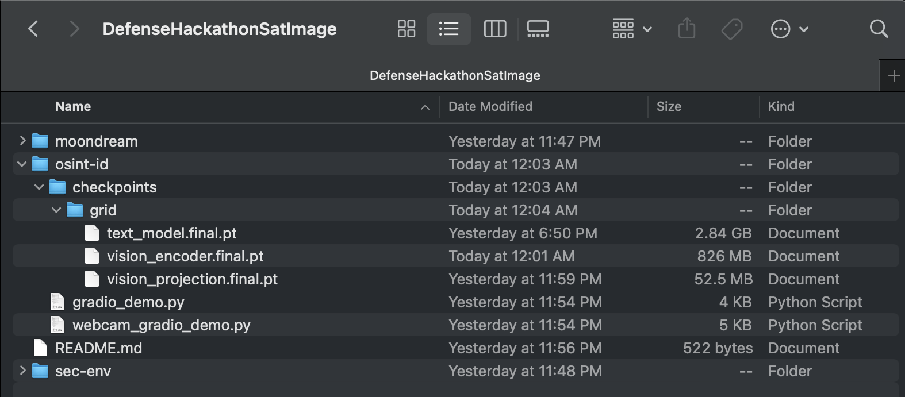

# DefenseHackathonSatImage

## osint-id folder

1. make a python venv and activate it (i named mine sec-env but like just name it whatever you want and add it to [.gitignore](.gitignore))  
   
2. clone moondream repo, `cd moondream` and do `pip install transformers einops && pip install -r requirements.txt` (should probably add this as a submodule or something later)

3. follow instructions below for putting the weights in the `checkpoints/grid` folder

4. feel free to run [gradio_demo.py](osint-id/gradio_demo.py) or [webcam_gradio_demo.py](osint-id/webcam_gradio_demo.py) 

bounding box demo ([source](https://gist.github.com/vikhyat/b823783c79df2d513590c5f811436810))  
bounding box demo but for webcams ([source](https://gist.github.com/vikhyat/1eb2491b53567e994c75934ef603c225))  

weights in the notion doc in google drive (don't post)

save the google drive files in [osint-id folder](osint-id) inside `checkpoints/grid` with the names 
- text_model.final.pt (make sure to rename this one)
- vision_encoder.final.pt
- vision_projection.final.pt

should look something like this  

 

ignore folder sec-env, that's the python venv